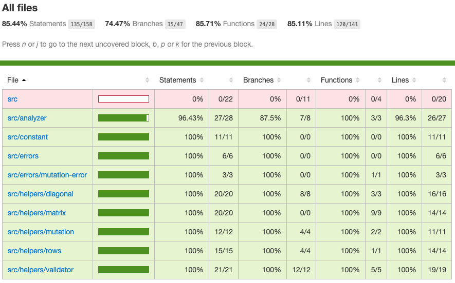

# dna-analyzer

Project that allows to analyze DNA chains and evaluate their behaviors.

***
### Run tests at localhost

* Open a terminal
```sh
# Check/Install latest version of node.js
$ node -v
v12.18.1

# Check/Install latest version of npm
$ npm -v
6.14.5
```
```sh
# check version Doker installation
$ docker -v
Docker version 20.10.0, build 7287ab3
```
```sh
# check docker-compose installation
$ docker-compose -v
docker-compose version 1.27.4, build 40524192
```
```sh
#Clone repository
$ git clone git@gitlab.com:josue.nolasco.miranda/dna-analyzer.git
```
```sh
# Install dependencies.
$ cd dna-analyzer
$ npm install
```
```sh
# Run tests
$ npm test

# Output
> dna-analyzer@1.0.0 test /Users/josh/repos/dna-analyzer
> jest src/ --coverage --detectOpenHandles --forceExit

 PASS  src/analyzer/index.spec.js
  analyzer
    hasMutation()
      ✓ should return false when dna is a 2x2 matrix (3 ms)
      ✓ should return false when dna is a 3x3 matrix (1 ms)
      ✓ should return false when dna has no mutations (3 ms)
      ✓ should return true when dna have more than one mutation (26 ms)
      ✓ should return true when dna have more than one Slash diagonal mutation (6 ms)
      ✓ should return true when dna have more than one BackSlash diagonal mutation (2 ms)
      ✓ should return true when dna have more than one vertical mutation (1 ms)
      ✓ should return true when dna have more than one horizontal mutation (2 ms)

 PASS  src/helpers/validator/index.spec.js
  validator
    check()
      ✓ should return error when dna is empty (4 ms)
      ✓ should return error when dna is not an array (2 ms)
      ✓ should return error when dna rows are not strings (2 ms)
      ✓ should return error when dna rows have no the same length
      ✓ should return error when dna is not an NxN matrix (1 ms)
      ✓ should return error when dna rows values are different than [A, T, C, G] (1 ms)
      ✓ should not return error when all dna validations are success (1 ms)

 PASS  src/helpers/rows/index.spec.js
  rows
    hasSequence()
      ✓ should return true where the array has sequence at the beginning
      ✓ should return true where the array has sequence at the middle (1 ms)
      ✓ should return true where the array has sequence at the end (1 ms)
      ✓ should return false when the array is empty
      ✓ should return false when the array has one element (1 ms)
      ✓ should return false when the array has no sequence of characters (1 ms)

 PASS  src/helpers/diagonal/index.spec.js
  diagonal
    getBackSlash()
      ✓ should return an array with all BackSlash diagonals (1 ms)
    getSlash()
      ✓ should return an array with all Slash diagonals (1 ms)

---------------------------|---------|----------|---------|---------|-------------------
File                       | % Stmts | % Branch | % Funcs | % Lines | Uncovered Line #s
---------------------------|---------|----------|---------|---------|-------------------
All files                  |   85.44 |    74.47 |   85.71 |   85.11 |
 src                       |       0 |        0 |       0 |       0 |
  app.js                   |       0 |        0 |       0 |       0 | 1-35
 src/analyzer              |   96.43 |     87.5 |     100 |    96.3 |
  index.js                 |   96.43 |     87.5 |     100 |    96.3 | 30
 src/constant              |     100 |      100 |     100 |     100 |
  index.js                 |     100 |      100 |     100 |     100 |
 src/errors                |     100 |      100 |     100 |     100 |
  index.js                 |     100 |      100 |     100 |     100 |
 src/errors/mutation-error |     100 |      100 |     100 |     100 |
  index.js                 |     100 |      100 |     100 |     100 |
 src/helpers/diagonal      |     100 |      100 |     100 |     100 |
  index.js                 |     100 |      100 |     100 |     100 |
 src/helpers/matrix        |     100 |      100 |     100 |     100 |
  index.js                 |     100 |      100 |     100 |     100 |
 src/helpers/mutation      |     100 |      100 |     100 |     100 |
  index.js                 |     100 |      100 |     100 |     100 |
 src/helpers/rows          |     100 |      100 |     100 |     100 |
  index.js                 |     100 |      100 |     100 |     100 |
 src/helpers/validator     |     100 |      100 |     100 |     100 |
  index.js                 |     100 |      100 |     100 |     100 |
---------------------------|---------|----------|---------|---------|-------------------
Test Suites: 4 passed, 4 total
Tests:       23 passed, 23 total
Snapshots:   0 total
Time:        1.294 s
```
### Code coverage report.

Once the tests are executed, at the root of the project you can find the folder "coverage". Open '/dna-analyzer/coverage/lcov-report/index.html' file to check the HTML code coverage report.

<p align="center"></p>

***
### Run application at Docker container in localhost.

* Open a terminal at root of project
```sh
$ cd dna-analyzer

# Build project
$ docker-compose up --build

# Output
Creating network "dna-analyzer_default" with the default driver
Building app
Step 1/7 : FROM node:12
 ---> f5be1883c8e0
Step 2/7 : WORKDIR /app
 ---> Using cache
 ---> 56bf18320b11
Step 3/7 : COPY ./package.json .
 ---> Using cache
 ---> af074b1178ce
Step 4/7 : RUN npm install
 ---> Using cache
 ---> b4fdee7e17db
Step 5/7 : COPY . .
 ---> 8229b17b468a
Step 6/7 : EXPOSE 3000
 ---> Running in fdeb88c7dee4
Removing intermediate container fdeb88c7dee4
 ---> 7a07ed546c1f
Step 7/7 : CMD npm run dev
 ---> Running in 067d736f605e
Removing intermediate container 067d736f605e
 ---> e287e7c2b21a

Successfully built e287e7c2b21a
Successfully tagged dna-analyzer_app:latest
Creating dna-analyzer_app_1 ... done
Attaching to dna-analyzer_app_1
app_1  |
app_1  | > dna-analyzer@1.0.0 dev /app
app_1  | > nodemon src/app.js
app_1  |
app_1  | [nodemon] 2.0.7
app_1  | [nodemon] to restart at any time, enter `rs`
app_1  | [nodemon] watching path(s): *.*
app_1  | [nodemon] watching extensions: js,mjs,json
app_1  | [nodemon] starting `node src/app.js`
app_1  |
app_1  | ::::: DNA analyzer is running on port 3000
```

## Mutation Endpoint

- **Description:**  Allows to analyze DNA chains and evaluate their behaviors
- **URL:**          http://localhost:3000/mutation
- **Content-Type:** application/json
- **Method:**       POST

## Mutation Request/Response examples

```sh
# DNA without mutations - HTTP/1.1 403 Forbidden

# Input
$ curl -i -X POST http://localhost:3000/mutation\        
-H "Content-Type: application/json" \
-H "Accept: application/json" \
-d '{ "dna":[ "ATGCGA", "CAGTGC", "TTATTT", "AGACGG", "GCGTCA", "TCACTG"] }'

# Output
HTTP/1.1 403 Forbidden
X-Powered-By: Express
Content-Type: text/html; charset=utf-8
Content-Length: 43
ETag: W/"2b-URW8uCXr52+bB4EgxM9xzdjeJV4"
Date: Fri, 08 Jan 2021 06:35:33 GMT
Connection: keep-alive
::::: The dna received has no mutation !!!%
```

```sh
# DNA with mutations - HTTP/1.1 200 OK

# Input
$ curl -i -X POST http://localhost:3000/mutation\        
-H "Content-Type: application/json" \
-H "Accept: application/json" \
-d '{ "dna":[ "ATGCGA", "CAGTGC", "TTATGT", "AGAAGG", "CCCCTA", "TCACTG"] }'

# Output
HTTP/1.1 200 OK
X-Powered-By: Express
Content-Type: text/html; charset=utf-8
Content-Length: 40
ETag: W/"28-x26hTWxQd4W/BIYVpSLiIR/t1rE"
Date: Fri, 08 Jan 2021 06:38:50 GMT
Connection: keep-alive
::::: The dna received has mutation !!!%
```

```sh
# DNA validation errors - HTTP/1.1 400 Bad Request

# Input
$ curl -i -X POST http://localhost:3000/mutation\        
-H "Content-Type: application/json" \
-H "Accept: application/json" \
-d '{ "dna":[ 1, true, true] }'

# Output
HTTP/1.1 400 Bad Request
X-Powered-By: Express
Content-Type: text/html; charset=utf-8
Content-Length: 33
ETag: W/"21-NaqC56i93itrRz5+xmAjbxOLUvE"
Date: Fri, 08 Jan 2021 06:39:52 GMT
Connection: keep-alive

Error: dna rows must to be string%
```